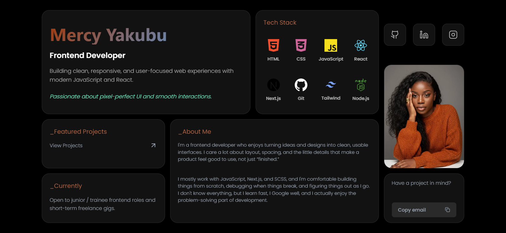

# Portfolio Website

A modern, responsive portfolio website built with Next.js featuring a unique bento grid layout. Showcases my frontend development projects and skills.



## 🌐 Live Demo

**[View Live Portfolio](https://portfolio-bento-grid-ten.vercel.app/)**

## ✨ Features

- **Bento Grid Layout** - Modern, card-based design inspired by iOS widgets
- **Fully Responsive** - Optimized layouts for desktop, tablet, and mobile devices
- **Projects Showcase** - Dedicated page displaying detailed project information
- **Dark Theme** - Sleek dark mode design with custom color scheme
- **Smooth Animations** - Hover effects and transitions for enhanced UX
- **Performance Optimized** - Built with Next.js for fast loading and SEO

## 🛠️ Built With

- **[Next.js 14](https://nextjs.org/)** - React framework for production
- **[React 18](https://react.dev/)** - JavaScript library for building UI
- **[SCSS](https://sass-lang.com/)** - CSS preprocessor for advanced styling
- **[Vercel](https://vercel.com/)** - Deployment and hosting platform

## 🚀 Getting Started

### Prerequisites

- Node.js 18.x or higher
- npm or yarn package manager

### Installation

1. Clone the repository
```bash
git clone https://github.com/Mercyaksss/portfolio-bento-grid.git
cd portfolio-bento-grid
```

2. Install dependencies
```bash
npm install
# or
yarn install
```

3. Run the development server
```bash
npm run dev
# or
yarn dev
```

4. Open [http://localhost:3000](http://localhost:3000) in your browser

## 🎨 Key Components

- **HeroCard** - Introduction and main heading
- **PhotoCard** - Profile image display
- **ProjectsCard** - Quick access to projects page
- **TechStackCard** - Display of technical skills and technologies
- **AboutCard** - Personal introduction and background
- **ContactCard** - Email contact information
- **SocialsGroup** - Social media links
- **CurrentlyCard** - Current status and availability

## 📱 Responsive Design

The portfolio features three responsive breakpoints:

- **Desktop** (1200px+) - Full bento grid layout
- **Tablet** (768px - 1200px) - Adjusted grid with 3 columns
- **Mobile** (<768px) - Single column stacked layout

## 🚧 Future Improvements

- [ ] Add blog section
- [ ] Implement dark/light mode toggle
- [ ] Add project filtering by technology
- [ ] Include case studies for major projects
- [ ] Add animations library (Framer Motion)

## 📄 License

This project is open source and available under the [MIT License](LICENSE).

## 👤 Contact

**Mercy Yakubu**

- Portfolio: [portfolio-bento-grid-ten.vercel.app](https://portfolio-bento-grid-ten.vercel.app/)
- GitHub: [@Mercyaksss](https://github.com/Mercyaksss)
- Email: mercyaksss625@gmail.com

---

⭐ If you like this project, please consider giving it a star on GitHub!